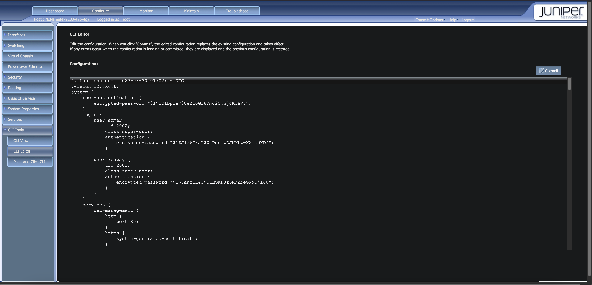

# juniper-dhcp-leak-case-study
Faced a very educative problem which gave me experience and exposure with juniper switches, My first involvement/experience with JunOS.

## Background:
Our office’s CCTV, one interface of NAS, Access Points, and NVR run on a Juniper ex2200 POE switch. The switch doesn’t have DHCP active and all devices are assigned static IPs from the end device’s config. The issue arised when our boss requested a centralized location to view CCTV recordings and live view. Generally this can be achieved with the NVR linked to the mobile app but since the use of different CCTV brands across the various company branches and the existence of the other branches it was not possible with our onsite NVR. Before starting the operation in Sri Lanka to overcome this issue “Videoloft” cloud adapters were used by the different foreign operations to create a centralized CCTV solution. Therefore we were given one.

(images/02.png)

## The Problem:
After receiving the Videoloft Cloud Adapter is when we discovered this “DHCP Leak” after connecting the cloud adapter to the ex2200 it is expected for it to have no IP address or self-assign a link-local (169.254.x.x) address due to the absence of DHCP, which can then be identified using tools like nmap, ARP tables, or MAC address inspection after connecting a scanning device to the ex2200. But when we attached the scanner device we observed that it received an IP from the 192.168.10.x range, which belongs to the DHCP pool of one of our access points which NATs which was not expected since the laptop was connected directly to the switch instead of directly connecting to the access point. Even then when we ran a network scan to search for the video loft we discovered that it had the same issue where it received an IP from the same access point. For context cameras are configured with 192.168.0.x static.

(images/03.png)

(images/04.png)

## Initial Attempts:

-We then thought simply to just change the Videoloft cloud adapter to a static IP in 192.168.0.x range, but for our bad luck the specific model we had of the cloud adapter doesn’t support assigning a static IP.
-Then applied DHCP to the ex2200 switch but then had a full wireless network outage but didn’t cause much damage because operation team machines are connected via ethernet as well to the other switches. After doing so the video loft adapter still continued to receive an IP from the access point (192.168.10.x) instead of the DHCP from switch (192.168.0.x)
-Also considered using CCTV manager app from symbology with our NAS but then other operations will have to do so as well which is convenient since they all have video loft cloud adapter configured
